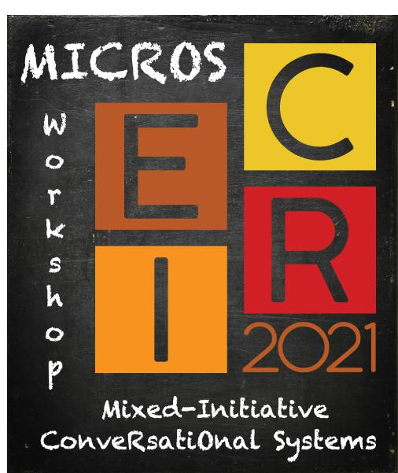

---
  header:
    title: Home
    weight: 1
---

<!--html_preserve-->

<!-- Global site tag (gtag.js) - Google Analytics -->
  
  

<!--/html_preserve-->

### Overview

The increasing popularity of personal assistant systems and smartphones has drawn attention to conversational systems. Thanks to the recent advances in automatic speech recognition and voice generation, conversational systems are largely employed in smart-home devices (e.g., Google Home, Amazon Alexa) as well as wearable devices (e.g., Apple Siri, Microsoft Cortana, Google Assistant). 

The 1st Edition of the Workshop on _Mixed-Initiative ConveRsatiOnal Systems_ (MICROS@ECIR2021) aims at investigating and collecting novel ideas and contributions in the field of conversational systems. These systems provide a conversational interface for different tasks ranging from seeking information to performing e-commerce transactions. 

MICROS aims to bring together researchers from academia and industry to discuss the challenges and future of conversational systems. The workshop will have a particular focus on mixed-initiative conversational systems. These proactive systems do not simply provide answers but also propose possible interpretations for ambiguous and vague requests, improving the user's information-seeking experience.

We invite people working on conversational search as well as interactive recommendation to send us their position and research papers. Novel approaches for conversational information seeking that are based on natural language processing and artificial intelligence are also welcome. We encourage submissions on  approaches for conversational search, recommendation, evaluation techniques, data creation and curation, as well as domain-specific applications for conversational systems. The workshop will prioritize innovative and impactful contributions, all the accepted papers will be presented as contribution talks and will have the opportunity to be published in the CEUR proceedings. 
The workshop will also have keynote talks by experienced researchers and a panel discussion to share insights about conversational systems. 

Please visit also the [Call for Paper](https://easychair.org/cfp/micros2021)

Follow us on Twitter: [@micros2021](https://twitter.com/micros2021)

### Organizers

- Ida Mele (IASI-CNR Rome, IT)
- Cristina Ioana Muntean (ISTI-CNR Pisa, IT)
- Mohammad Aliannejadi (University of Amsterdam, NL)
- Nikos Voskarides (University of Amsterdam, NL) 

### Important Dates

Time zone: Anywhere on Earth (AoE)

- Submission deadline: ~~December 20, 2020~~ **[EXTENDED] January 22, 2021**
- Notification:	~~February 5, 2021~~ [EXTENDED] February 15, 2021
- ECIR (free) registration deadline: March 25, 2021 -- Authors of workshop papers can use a free registration (see below) --
- Workshop day:	April 1, 2021

### [NEW] Registration information

Registration: The authors of **workshop papers** can use the **"Free registration (0 EUR registration fee)"** for attending ECIR 2021.

Please follow ECIR registration instructions [here](https://www.ecir2021.eu/registration/) 

The registration form for you to fill in is [here](https://bit.ly/3oZO41I)

**Free registrations close on March 25, 2021.** 

**Very important:** Note that **one registration (paid or free) is required for participating in ECIR 2021, so free registration is not the same as no registration.** 

**Very important:** Notice that in case you have also a **non-workshop paper**, and no other co-authors have registered with a paid registration for it, you'll have to register with a **paid registration for that paper by Feb. 5, 2021**.

### Accepted Papers
- Tom Lotze, Stefan Klut, Mohammad Aliannejadi and Evangelos Kanoulas. _"Ranking Clarifying Questions Based on Predicted User Engagement"_  -- [download PDF](pubs/Lotze_MICROS2021.pdf) --

- Maddalen Lopez de Lacalle, Xabier Saralegi and Inhar Lopez. _"Reducing annotation effort for Cross-lingual Transfer Learning: The case of NLU for Basque"_  -- [download PDF](pubs/Lopez_MICROS2021.pdf) --

- Abhishek Kaushik and Gareth Jones. _"A Conceptual Framework for Implicit Evaluation of Conversational Search Interfaces"_ -- [download PDF](pubs/Kaushik_MICROS2021.pdf) --

- Nikolaos Kondylidis, Jie Zou and Evangelos Kanoulas. _"Category Aware Explainable Conversational Recommendation for Cold-Start Setting"_ -- [download PDF](pubs/Kondylidis_MICROS2021.pdf) --

**The final version of accepted papers will be available on this website before the workshop.**

### Keynote Speakers
- Claudia Hauff _(Delft University of Technology, NL)_ -- [website](https://chauff.github.io/) 

  Talk title: _"On the analysis and training of neural IR models in the context of conversational search and recommendation"_ 
- Jian-Yun Nie _(University of Montreal, Canada)_ -- [website](http://rali.iro.umontreal.ca/nie-site/jian-yun-nie-en/) 

  Talk title: _"Goal-oriented search for dialogue and question answering"_ 
- Filip Radlinski _(Google Research, London, UK)_ -- [website](http://www.radlinski.org/) 

  Talk title: _"Natural language and mixed initiative"_

### Panelists 
- Nicholas Belkin _(Rutgers University, USA)_
- Claudia Hauff _(Delft University of Technology, NL)_ 
- Julia Kiseleva _(Microsoft Research, Seattle, USA)_ -- Panel moderator
- Jian-Yun Nie _(University of Montreal, Canada)_
- Filip Radlinski _(Google Research, London, UK)_
- Hamed Zamani _(University of Massachusetts Amherst, USA)_

### Schedule

The MICROS program is available [here](pubs/MICROS_Workshop_Program.pdf)

### Submissions

Papers must be submitted by **January 22, 2021 (23:59 AoE)** via EasyChair. Submitted papers should be in the Springer LNCS format. The workshop has a **single-blind** reviewing process, so the submissions can include the name and affiliations of authors.
 
Submission Page: [EasyChair](https://easychair.org/conferences/?conf=micros2021)

The following paper categories are welcome:
- research papers on novel, original, and unpublished work (pre-prints submitted to ArXiv are eligible). **Max length: 10 pages, plus references**
- extended abstracts summarizing published results. **Max length: 5 pages, plus references**

All accepted works will be presented at the workshop. Moreover, the research papers can be included in an open-access post-proceedings volume of CEUR Workshop Proceedings [http://ceur-ws.org/](http://ceur-ws.org/). The workshop results will be published as a summary paper in the proceedings of ECIR 2021 conference, too. 

### Topics
The workshop topics include but are not limited to:

- Applications of conversational search and recommendation systems
    - Large-scale retrieval candidate responses (e.g., documents, passages) in conversational search
    - Conversational and question-based recommendation systems
    - Tracking information-need evolution during the conversation (e.g., context changes)
    - Processing and rewriting of natural language conversational queries
    - Relevance feedback in conversational search
- Mixed-initiative interaction systems, such as clarification and preference elicitation in conversational systems
     - Dialogue schema for conversational search
    - Conversational navigation of search results
    - Conversation history understanding and query modeling
    - Pro-active search and recommendation interactions in conversational search
- Deep learning and reinforcement learning for conversational search
    - Conversational question answering
    - Result summarization, explanation, and presentation in conversational search
    - Balance and bias for more inclusive conversational systems
- Multi-modal interactions for conversational interfaces (e.g., speech-only and small-screen interfaces)
    - Voice-based search engine operations
    - User intent and dialog state tracking in conversational search
    - Personalization and user models for conversational search
- Specialized applications and use  cases for conversational search (e.g., health, finance, travel)
- Knowledge graph presentation in conversational search
- Data creation and curation for conversational search
- Evaluation metrics for effectiveness, engagement, user satisfaction of conversational systems

### Program committee

- Avishek Anand, L3S Research Center Hannover, DE
- Mikhail Burtsev, MIPT Moscow, RU
- Manajit Chakraborty, University of Lugano, CH
- Aleksandr Chuklin, Google Zurich, CH
- Helia Hashemi, UMass Amherst, USA
- Kai Hui, Amazon Alexa Search, DE
- Evangelos Kanoulas, University of Amsterdam, NL
- Sean MacAvaney, Georgetown University, USA
- Diego Marcheggiani, Amazon Barcelona, ES
- Franco Maria Nardini, ISTI-CNR Pisa, IT
- Gustavo	Pehna, TU Delf, NL
- Raffaele Perego, ISTI-CNR Pisa, IT
- Pengjie Ren, University of Amsterdam, NL
- Estaban Andres Rissola, University of Lugano, CH
- Rishiraj Saha Roy, MPII Saarbruecken, DE
- Mark Sanderson, RMIT Melbourne, AU
- Fabrizio Silvestri, Facebook London, UK
- Damiano Spina, RMIT Melbourne, AU
- Nicola Tonellotto, University of Pisa, IT
- Johanne Trippas, University of Melbourne, AU
- Hamed Zamani, UMass Amherst, USA
- Jie Zou, University of Amsterdam, NL
